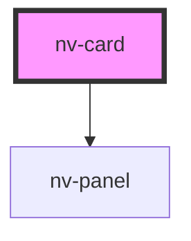

# nv-card

<!-- Auto Generated Below -->

## Properties

| Property    | Attribute   | Description                     | Type      | Default |
| ----------- | ----------- | ------------------------------- | --------- | ------- |
| `clickable` | `clickable` | If true, card will be clickable | `boolean` | `false` |

## Slots

| Slot | Description                                        |
| ---- | -------------------------------------------------- |
|      | Content that is placed in the card above the title |

## CSS Custom Properties

| Name                              | Description                  |
| --------------------------------- | ---------------------------- |
| `--nv-card-description-color`     | Color of the description     |
| `--nv-card-description-font-size` | Font size of the description |
| `--nv-card-title-color`           | Color of the title           |
| `--nv-card-title-font-size`       | Font size of the title       |

## Dependencies

### Depends on

- [nv-panel](../panel)

### Graph

----------------------------------------------

* NithView *
