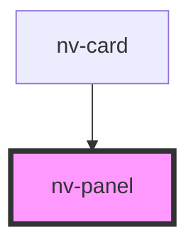

# nv-panel

<!-- Auto Generated Below -->

## Properties

| Property    | Attribute   | Description                                          | Type      | Default |
| ----------- | ----------- | ---------------------------------------------------- | --------- | ------- |
| `clickable` | `clickable` | If true, active, hover, focus styles will be applied | `boolean` | `false` |

## Slots

| Slot | Description                         |
| ---- | ----------------------------------- |
|      | Content that is placed in the panel |

## CSS Custom Properties

| Name                       | Description                |
| -------------------------- | -------------------------- |
| `--nv-panel-background`    | Background of the panel    |
| `--nv-panel-border-radius` | Border radius of the panel |
| `--nv-panel-padding`       | Padding in the panel       |

## Dependencies

### Used by

 - [nv-card](../card)

### Graph

----------------------------------------------

* NithView *
